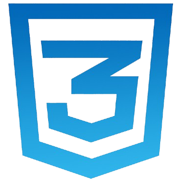

#  Welcome to my GitHub page
### 🌟 **Aspiring Polymath | Pre-Engineering Student | Future Data Analyst**  
#### Coding & Robotics Hobbyist | Lifelong Learner  

---

> "𝑻𝒉𝒆 𝒐𝒏𝒍𝒚 𝒕𝒓𝒖𝒆 𝒘𝒊𝒔𝒅𝒐𝒎 𝒊𝒔 𝒊𝒏 𝒌𝒏𝒐𝒘𝒊𝒏𝒈 𝒚𝒐𝒖 𝒏𝒆𝒆𝒅 𝒎𝒐𝒓𝒆 𝒔𝒉𝒊𝒊𝒊𝒊… 𝒔𝒍𝒆𝒆𝒑, 𝒃𝒓𝒐."  
– 𝑺𝒐𝒄𝒓𝒂𝒕𝒆𝒔 (𝒑𝒓𝒐𝒃𝒂𝒃𝒍𝒚)

---

## **About Me**  

My main goal is to become a great mathematician. At the same time, I want to learn about other areas and become a polymath—someone skilled in many different fields.
- 🛠️ **Engineering:** Solving problems with practical solutions.  
- 🤖 **Coding & Robotics:** Creating systems that combine creativity and technical skills.  
- 📊 **Data Analysis:** Finding insights to make smart, data-driven decisions.  
- 📚 **Lifelong Learning:** Growing my knowledge and exploring different subjects.

🎯 **Future Goal:** Pursue a Ph.D. in mathematics and build a career in data analytics!  
💼 **Open To Opportunities:** Internships, collaborations, or entry-level positions in engineering or data analysis.  

### **What I Do**  
- **Engineering & Advanced Mathematics:** Currently studying engineering alongside advanced mathematics, including algebra and real analysis.
- **Individual Projects:** Developing custom scripts and bots to automate tasks and explore creative coding ideas.
- **Living:** Just trying to survive, balancing work & studies.

### **Statistics**

  

  
  

---

## **🛠️ Tech & Tools I Use**  

### Skilled & Experienced in:

  

  <strong>Absolutely nothing</strong>

### Struggling to Learn:

  

  
  
  
  
  
  
  

### Looking Forward to Learning:

  

  
  
  
  
  
  
  
  
  
  
  
  
  
  
  

---

## **✉️ Contact Me**   |   🔗 **Connections**

  
  
  
  
  

### 🌍 **Support Me:**

  
    
  

---

**Feel free to connect or collaborate!** 😊  
